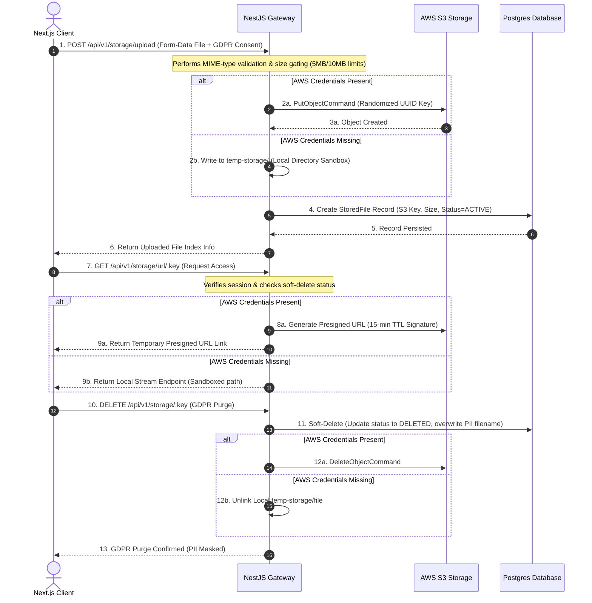

# 🚀 Beleqet Jobs - Cloud Object Storage Module (S3)

**Branch:** `feat/bemnet-s3-storage`  
**Task Category:** Performance & Network Module (Round 2 Technical Assessment)

An enterprise-grade, secure cloud object storage module integrated into the Beleqet Jobs platform. Built with **NestJS (V10)**, **Next.js (V14)**, **PostgreSQL (via Prisma)**, and **AWS S3 SDK v3**. This module handles candidate file uploads (Resumes, Portfolios, Profile Images) securely, ensuring that zero files are hosted directly on the server, while enforcing strict GDPR privacy compliance and localized translations.

---

## 🏗️ Architecture & Security Lifecycle

The module operates on a secure sequence flow bypassing direct local server exposure, with a robust local directory fallback if S3 credentials are not configured.



---

## 🌟 Key Technical Implementations

### 1. Security & Size Constraints (Gating)
*   **Dual-Layer Validation:** Enforced both on the client-side (Next.js) and strictly on the server-side (NestJS Multer interceptors) before hitting S3.
*   **Size Constraints:** Hard limit of **5MB** for images and **10MB** for documents (PDF, DOC, DOCX, TXT).
*   **MIME-Type Whitelisting:** Rejects executables, scripts, or unwhitelisted media to prevent malicious uploads.

### 2. GDPR Compliance ("Right to be Forgotten")
*   **Soft-Deletion:** Records are soft-deleted from the database logs.
*   **PII Metadata Masking:** The original file name is overwritten with a generic compliance label (`DELETED_GDPR_COMPLIANCE_MASKED`) in active logs to purge all Candidate Personal Identifiable Information (PII).
*   **Physical Purge:** The actual file is immediately and permanently removed from AWS S3 or the local fallback disk storage upon deletion.

### 3. Multi-Currency Accounting Engine
*   **Safe Integer Math:** Built currency calculations utilizing integer cents (`USD`) and Santims (`ETB`) to prevent floating-point errors (e.g. `0.1 + 0.2 = 0.30000000000000004`).
*   **Toggles:** Supports switching calculations dynamically between `$1.00 USD` (100 cents) and `50.00 ETB` (5000 Santims).

### 4. Dual-Language Translation (i18n)
*   Provides dynamic English and **አማርኛ (Amharic)** translation toggles mapped across every dashboard panel, table headers, dropzone instructions, and system state badges.

---

## 🚀 Getting Started (Local Development)

### Prerequisites
*   [Docker Desktop](https://www.docker.com/products/docker-desktop/)
*   [Node.js v20+](https://nodejs.org/)

### 1. Boot up the Backend Infrastructure
The backend is dockerized and contains PostgreSQL, Redis, and the NestJS application server.

```bash
# Clone the repository and checkout feature branch
git checkout feat/bemnet-s3-storage

# Rebuild and start container services
docker-compose up -d --build
```

### 2. Run Database Seeding
To access the developer dashboard portals, you must seed the default reviewer credentials into the PostgreSQL container:

```bash
docker cp backend/create-admin.js beleqet-backend:/app/create-admin.js
docker exec beleqet-backend node create-admin.js
```
*   **Developer Credentials:** `admin@beleqet.com` / `SecurePass123!`

### 3. Boot the Next.js Frontend
Navigate to the Next.js app directory, install dependencies, and run the dev server on port **3001** (to avoid conflicts with standard local setups):

```bash
cd beleqet-jobs-nextjs
npm install
npx next dev -p 3001
```
Open **[http://localhost:3001/storage](http://localhost:3001/storage)** in your browser.

---

## 🧪 Testing

We have built a comprehensive suite of unit tests testing validation boundaries, fallbacks, and compliance logic.

*   To run the Jest tests locally inside the `backend` folder:
    ```bash
    npm run test
    # Or to run the storage module tests specifically:
    npx jest src/modules/storage
    ```

---

## 🛡️ Sandbox & Path Safeguards
*   **Directory Traversal Blocks:** If S3 credentials are missing, local files are retrieved via `/api/v1/storage/local-file/:filename`. The controller sanitizes input to prevent attacks trying to access system files (e.g. `../../etc/passwd`).
*   **15-minute Link TTL:** Presigned URLs use temporary signatures with a strict 15-minute Time-To-Live (TTL) constraint, preventing permanent link leak exposure.
